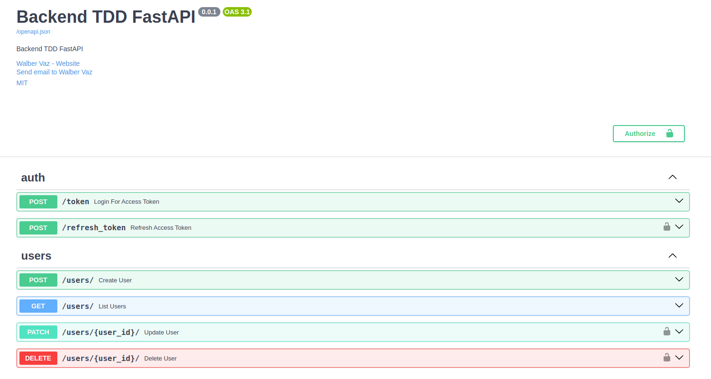

# Projetos backend usando Fastapi com TDD

## O projeto

O projeto consiste em uma API para gerenciamento de usuários e seus endereços. Usando o framework Fastapi e o conceito de TDD onde primeiro é criado os testes e depois a implementação. Nesse projeto fiz o misto criando os testes e implementando ao mesmo tempo.

<div align="center">
  
  
  
  
  
  
  
  
  
  
  
</div>

## Tecnologias

- Python 3.11.5
- Fastapi
- Pydantic
- SQLAlchemy
- SQLite
- Docker
- Docker-compose
- Poetry
- Flake8
- Black
- Pytest
- Pytest-cov

## Estrutura do projeto

```bash
├── alembic.ini
├── backend_tdd_fastapi
│   ├── app.py
│   ├── conf
│   │   └── settings.py
│   ├── infra
│   │   ├── database.py
│   │   └── seeds.py
│   ├── modules
│   │   ├── auth
│   │   │   ├── controller
│   │   │   │   └── generate_token.py
│   │   │   └── dto
│   │   │       └── schema.py
│   │   └── user
│   │       ├── controller
│   │       │   ├── create_user.py
│   │       │   ├── delete_user.py
│   │       │   ├── get_user.py
│   │       │   └── update_user.py
│   │       ├── dto
│   │       │   └── schemas.py
│   │       └── model
│   │           └── user_model.py
│   ├── routers
│   │   └── __init__.py
│   └── security.py
├── DOCS.png
├── LICENSE
├── migrations
│   ├── env.py
│   ├── README
│   ├── script.py.mako
│   └── versions
│       └── a7baecc21ccf_create_users_table.py
├── poetry.lock
├── pyproject.toml
├── README.md
└── tests
    ├── conftest.py
    ├── __init__.py
    ├── test_app.py
    ├── test_auth.py
    ├── test_db.py
    └── test_security.py
```

## Licença

Distribuido sob a licença MIT License. Veja `LICENSE` para mais informações.

## Autor

- **Walber Vaz** - [Walber Vaz](https://github.com/walber-vaz)
